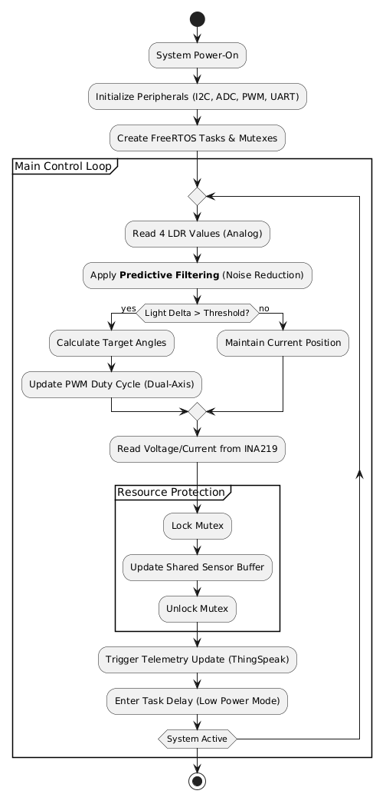
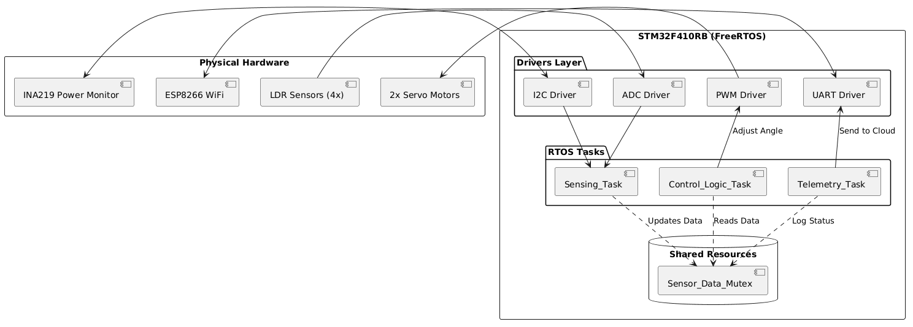

<!-- Proje Günlüğü -->
# Milestone 1: Requirement Analysis (Scope & Peripherals)

1. **Project Scope (Proje Kapsamı)**  
    Bu proje, güneş panellerinin verimliliğini artırmak amacıyla çift eksenli (azimut ve yükseklik) bir takip sistemi tasarlamayı kapsar. Sistem:
    a. 4 adet LDR sensörü aracılığıyla ışık yoğunluğunu takip edecektir.
    b. STM32F410RB mikrodenetleyicisi üzerinde FreeRTOS işletim sistemi kullanarak gerçek zamanlı       çalışacaktır.
    c. Panelden elde edilen anlık güç verilerini (voltaj/akım) INA219 üzerinden okuyacaktır.
    d. Verileri ESP8266 üzerinden bulut tabanlı bir veritabanına (ThingSpeak) aktaracaktır.

2. **Objectives (Hedefler)**    
    Maksimum Verimlilik: Güneş panelini her zaman ışığa dik açıyla (90°) tutarak enerji kazanımını maksimize etmek.

    Gürültü Azaltma: LDR verilerindeki çevresel gürültüyü Predictive Filtering (Öngörülü Filtreleme) ile minimize ederek servoların gereksiz titremesini (jitter) önlemek.

    Güç İzleme: Sistemin kendi tükettiği enerji ile panelden üretilen enerjiyi karşılaştırmak için hassas ölçüm yapmak.

    Modülerlik: Yazılımı, donanım bağımlılığını minimize eden bir katmanlı mimari (HAL/LL) ile geliştirmek.

3. **Constraints (Kısıtlamalar & Sınırlar)**  
    Donanım Sınırı: STM32 Nucleo board'un sunduğu akım limitleri dahilinde kalınmalıdır. Servolar yüksek akım çektiği için harici besleme kullanılacaktır (Common Ground unutulmadan).

    Gerçek Zamanlılık: Motor kontrol döngüsü, sistemin stabilitesi için en yüksek önceliğe sahip olmalı ve gecikme <20ms olmalıdır.

    Enerji Bütçesi: Sistemin kontrol ve haberleşme için harcadığı enerji, güneş takibi sayesinde kazanılan ek enerjiden düşük olmalıdır.

    Bağlantı: WiFi üzerinden veri gönderimi sırasında oluşabilecek ağ kopmalarında sistemin kilitlenmemesi (non-blocking) sağlanmalıdır.

4. **STM32 Peripheral Selection (Donanım Konfigürasyonu)**  

Hangi pinleri kullanacağını netleştirmen lazım.
   - ADC: LDR okumaları için (ADC1 IN0, IN1, IN4, IN8).
   - I2C: INA219 güç sensörü için (I2C1 SDA/SCL).
   - PWM: 2 adet servo motor için (TIM2 / TIM3 PWM).
   - UART: ESP8266 veri aktarımı için (USART1 TX/RX).
   - UART: Debug için (USART2 VCP).
   - GPIO: Status LED / Heartbeat için.

| Peripheral | Purpose | Connection Detail |
| --- | --- | --- |
| ADC1 | LDR Sensing | 4 Channels (IN0, IN1, IN4, IN8) - 12-bit Resolution |
| I2C1 | Power Monitor | INA219 Communication (SDA/SCL) |
| TIM2 / TIM3 | Servo Control | 2x PWM Outputs (50Hz Signal) |
| USART1 | WiFi Communication | ESP8266 AT Commands (TX/RX) |
| USART2 | Debugging | PC Terminal (VCP üzerinden log takibi) |
| GPIO | Status LEDs | System Heartbeat (LD2 - PA5 hariç, senin düzeltmene göre!) |

# Milestone 2: System Design (UML & Task Prioritization)

1. **Hardware** Architecture (Donanım Mimarisi) 
    Sistemin fiziksel katmanı, STM32F410RB merkezli bir yıldız topolojisidir.

    i. Sensing Layer: 4 adet LDR, voltaj bölücü (voltage divider) devresi üzerinden ADC pinlerine bağlanır.

    ii. Actuator Layer: Yatay (Azimuth) ve Dikey (Elevation) eksenler için 2 adet servo motor, Timer'lar üzerinden üretilen 50Hz PWM sinyali ile kontrol edilir.

    iii. Power Management: INA219, 0.1Ω şönt direnci ile yüksek taraftan (high-side) panel akımını izler.

    iv. Communication: ESP8266, sistemin ana döngüsünü engellememek (non-blocking) için UART üzerinden kesme (interrupt) veya DMA tabanlı haberleşme ile yönetilir.

2. **Software Architecture (Yazılım Mimarisi)** 

    Sistem, FreeRTOS tabanlı çok görevli (multi-tasking) bir yapıda tasarlanmıştır. Bu mimari, sistemin ölçeklenebilirliğini ve güvenilirliğini sağlar.

    2.1. FreeRTOS Task Design (Görev Dağılımı)   

    | Task | Priority | Frequency | Responsibilities |
    | --- | --- | --- | --- |
    | vControlTask | High (3) | 20ms | Predictive Filtering uygulaması, Error hesaplama ve PWM güncelleme. |
    | vSensingTask | Normal (2) | 100ms | ADC'den LDR değerlerini ve I2C'den INA219 verilerini okuma. |
    | vTelemetryTask | Low (1) | 15s | Verilerin JSON formatında paketlenmesi ve ESP8266 ile ThingSpeak'e iletimi. |

    2.2.Inter-Task Communication & Resource Protection  
        
        - Shared Resource: Sensör verileri bir global struct içinde tutulur.
        
        - Mutex Mechanism: vSensingTask veri yazarken ve vControlTask veri okurken veri bütünlüğünü (data integrity) korumak için Mutex kullanılacaktır. Bu, PhD seviyesindeki bir gömülü sistem projesinin olmazsa olmazıdır. 

3. **UML Diagrams (PlantUML)** 
    Diyagramları .png olarak kaydet ve PlantUML klasörüne at. 
    ### **System Structure**
    

    ### **System Activity Flow**
    

    RTOS Önceliklendirmesini yap.
    1. Control Task (High): Motorların hızlı tepki vermesi için.
    2. Sensing Task (Medium): Veri okuma.
    3. Telemetry Task (Low): Buluta veri gönderme (İnternet yavaştır, sistemi bekletmesin).

# Milestone 3: Prototype Development (Drivers)
**Görev:** STM32CubeIDE ile bir proje oluşturup .ioc dosyasında bu çevre birimlerini (I2C, ADC, PWM) aktif etmelisin.