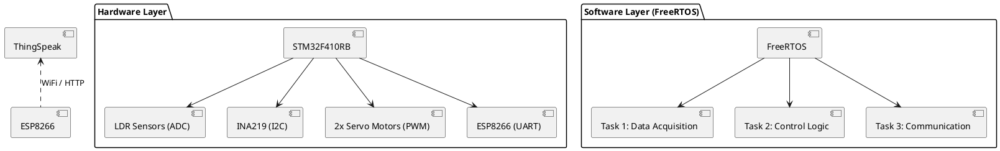
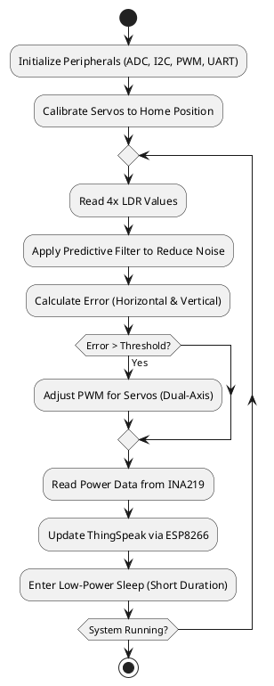

# **ELE529E Embedded Systems Project Progress Report**  

**Course:** ELE529E Embedded Systems   
**Submission Date:** [30/04/2026]  

---

## **1. Project Overview**  
| **Project Title**         | [Intelligent Dual-Axis Solar Tracker with Predictive Filtering] |  
|---------------------------|---------------------|  
| **Team Members**          | [Makbule Ozge Ozler] ([704252003]), [Mehmet Furkan Kalem(unofficially registered)] ([504251293]) |  
| **Project Start Date**    | [13/03/2026] |  
| **Expected Completion**   | [22/05/2026] |  

---

## **2. Project Milestones & Delivery Plan**  
| **Milestone**            | **Tasks** | **Deadline** | **Status (✓/✗)** |  
|--------------------------|-----------|--------------|------------------|  
| **1. Requirement Analysis** | Define project scope, objectives, constraints and STM32 peripheral selection. | [20/03/2026] | ✗ |  
| **2. System Design** | Hardware/software architecture, UML diagrams FreeRTOS task prioritization, Pinout. | [10/04/2026] | ✗ |  
| **3. Prototype Development** | Implement core functionalities (Sensor drivers (ADC, I2C), PWM control for servos.). | [30/04/2026] | ✗ |  
| **4. Testing & Debugging** | Unit tests, system validation, performance analysis. Filtering optimization, power consumption profiling. | [15/05/2025] | ✗ |  
| **5. Final Demo & Report** | Final system integration and demo video preparation. Prepare presentation, submit final report. | [22/05/2026] | ✗ |  

---

## **3. Individual Contribution Plans**  

### **Student 1: [Makbule Ozge Ozler]**  
| **Task** | **Responsibility** | **Estimated Time** |  
|----------|--------------------|--------------------|  
| Software Architecture | Designing the system state-machine and UML logic flow. | 2 weeks |  
| Data Processing | Implementing predictive filtering (Kalman or EMA) for LDR data. | 2 weeks |  
| Control Algorithms | Logic analyzer, power profiling. | 1 week |  
| Cloud Integration | Managing UART communication for ESP8266 & ThingSpeak. | 1 week |  


### **Student 2: [Mehmet Furkan Kalem(unofficially registered)]**  
| **Task** | **Responsibility** | **Estimated Time** |  
|----------|--------------------|--------------------|  
| Hardware Setup | STM32 configuration, sensor interfacing. Peripheral initialization (ADC, I2C, PWM) on STM32F410. | 2 weeks |  
| Low-Level Drivers | Custom INA219 driver development and servo PWM logic. | 2 weeks |  
| Real-Time Scheduling | FreeRTOS task creation, Resource Protection (Mutex/Semaphores). | 1.5 week |  
| Optimization | Power-aware coding and hardware-level performance tuning. | 1 week |  
---

## **4. Project Quality Utility Tree**  
**Objective**: Ensure reliability, performance, and usability.  

```plaintext
1. Functional Correctness  
   ├── 1.1 Positioning Accuracy (±1° error margin for dual-axis)  
   ├── 1.2 Power Monitoring (INA219 precision <1%)  
   └── 1.3 Power Efficiency (Energy generated > System consumption)  

2. Robustness  
   ├── 2.1 Environmental Noise Handling (Predictive filtering on LDRs)  
   └── 2.2 Fault Recovery (Re-calibration after power loss)  

3. Maintainability  
   ├── 3.1 Modular Code (Separation of Hardware Abstraction Layer - HAL)  
   └── 3.2 Real-Time Monitoring (Live telemetry via ThingSpeak)  
```

---

## **5. Project Structure Diagram (PlantUML)**  


---

## **6. Activity Diagram (PlantUML)**  


---

## **7. Project Demo Setup**  
### **Hardware Requirements**  
- STM32F103 Development Board  
- 2x SG90/MG90S Servo Motors (For vertical and horizontal movement)  
- 4x LDR Sensors  
- ESP8266 (NodeMCU veya 01S)  
- INA219 High-Side DC Current Sensor  

### **Software Requirements**  
- STM32CubeIDE (As development environment)  
- FreeRTOS (For data management, CMSIS-RTOS integration)  
- ThingSpeak Dashboard (For data visualization)  

### **Demo Steps**  
1. System Startup: Power is applied and servo motors are moved to their starting position.  
2. Light Tracking: LDRs are lighted by a torch. A system moving the motors in such a direction that it gets the light with a right angle, is observed.    
3. Data Monitoring: Instant current and voltage data that are exported from ThingSpeak Dashboard  are shown in graph.  
4. Failure Scenario (Jitter-free Control): It is tested whether the system could still continue to work when one of sensors is closed.  

---

## **8. Risks & Mitigation**  
| **Risk** | **Probability** | **Impact** | **Mitigation Strategy** |  
|----------|----------------|------------|-------------------------|  
| Servo Jitter | High | Medium |Implement Dead-band logic in PWM control. |  
| Power Spikes | Medium | High | Use external power for Servos; common ground with STM32. |  
| WiFi Connection Loss| Medium | Low | Implement retry logic for ESP8266 AT commands.|  
| LDR Non-linearity| High | Medium | Use multi-point calibration and predictive filtering. |

---

## **9. Conclusion**  
This report outlines the planned development of **[Intelligent Dual-Axis Solar Tracker with Predictive Filtering]**, including:  
✔ Task distribution among team members.  
✔ Key milestones with deadlines.  
✔ Quality assurance strategies.  
✔ UML diagrams for system design.  

**Next Steps**: Begin prototyping the sensor interface module.  

--- 

**Appendices**  
- [A] Datasheets (STM32F103, Sensors)  
- [B] GitHub Repository Link:
  https://github.com/ozgeozler93/STM32F410_PhD_Projects/tree/main/02_Solar_Tracker_Project  
- [C] Meeting Minutes (Weekly Updates)  

--- 
