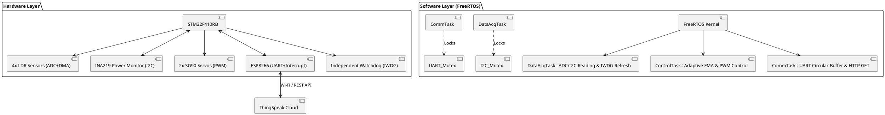
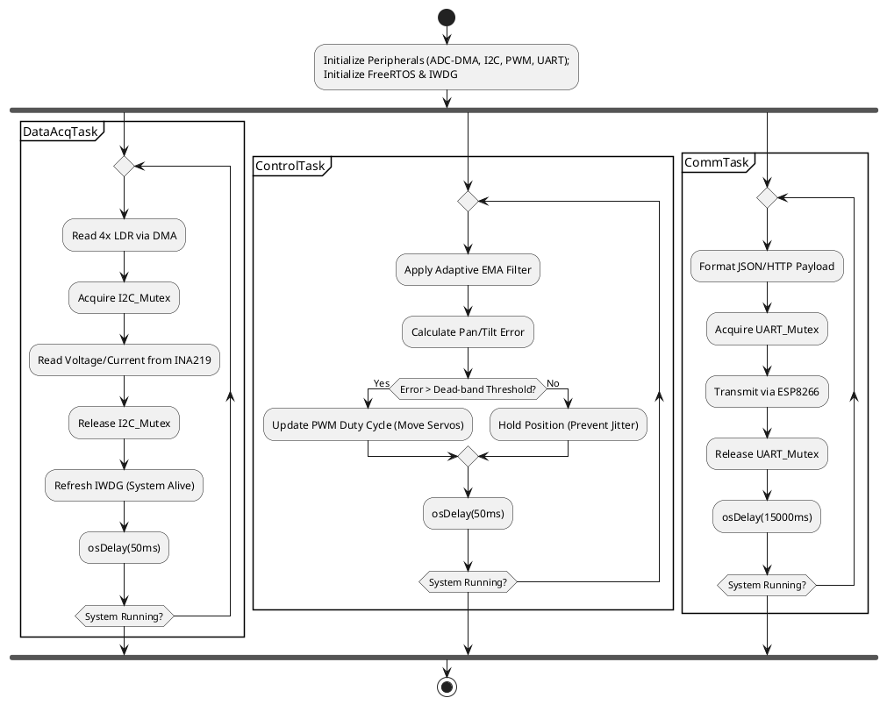

# **ELE529E Embedded Systems Project Progress Report**  

**Course:** ELE529E Embedded Systems   
**Submission Date:** [14/05/2026]  

---

## **1. Project Overview**  
| **Project Title**         | [Intelligent Dual-Axis Solar Tracker with Predictive Filtering] |  
|---------------------------|---------------------|  
| **Team Members**          | [Student 1 Name] ([Student 1 No]), [Student 2 Name] ([Student 2 No]) |   
| **Project Start Date**    | [DD/MM/YYYY] |  
| **Expected Completion**   | [22/05/2026] |  

---

## **2. Project Milestones & Delivery Plan**  
| **Milestone**            | **Tasks** | **Deadline** | **Status (✓/✗)** |  
|--------------------------|-----------|--------------|------------------|  
| **1. Requirement Analysis** | Define project scope, objectives, constraints and STM32 peripheral selection. | [20/03/2026] | ✓ |  
| **2. System Design** | Hardware/software architecture, UML diagrams, FreeRTOS task prioritization, Resource Protection (Mutex). | [10/04/2026] | ✓ |  
| **3. Prototype Development** | Implement core functionalities (e.g., sensor integration, Adaptive EMA Filter, Custom INA219/ESP8266 Drivers, IWDG). | [30/04/2026] | ✓ |  
| **4. Testing & Debugging** | Unit tests, system validation, performance analysis, jitter-free validation, power consumption profiling via ThingSpeak. | [15/05/2026] | ✗ |  
| **5. Final Demo & Report** | Final system integration on pertinax, demo video preparation, submit final report, prepare presentation. | [22/05/2026] | ✗ |  

---

## **3. Individual Contribution Plans**  

### **Student 1: [Makbule Özge Özler]**  
| **Task** | **Responsibility** | **Estimated Time** |  
|----------|--------------------|--------------------|  
| Software Architecture | Designing the FreeRTOS state-machine, Mutex integration, and UML logic flow. | 2 weeks |  
| Data Processing | Developing the Adaptive Exponential Moving Average (EMA) filter for noisy LDR data. | 2 weeks |  
| Cloud Integration | Managing UART communication (Circular Buffer) for ESP8266 & ThingSpeak API. | 1 week |  


### **Student 2: [Mehmet Furkan Kalem]**  
| **Task** | **Responsibility** | **Estimated Time** |  
|----------|--------------------|--------------------|  
| Hardware Setup | STM32F410RB configuration, sensor interfacing, and LM2596S power regulation. | 2 weeks |  
| Low-Level Drivers | Custom INA219 (I2C) and ESP8266 (UART/Interrupt) thread-safe driver development. | 1.5 weeks |  
| System Robustness | Independent Watchdog (IWDG) configuration and hardware-level performance tuning. | 1 week |  

---

## **4. Project Quality Utility Tree**  
**Objective**: Ensure industrial reliability, high performance, fault tolerance  and usability.  

```plaintext
1. Functional Correctness  
   ├── 1.1 Positioning Accuracy (±1° error margin via Adaptive EMA Filter)  
   ├── 1.2 Power Monitoring (INA219 precision <1% error)  
   └── 1.3 Asynchronous Telemetry (Zero data loss via UART Circular Buffer)  

2. Robustness  
   ├── 2.1 Resource Protection (Mutex locks on I2C and UART buses)  
   ├── 2.2 Fault Recovery (Independent Watchdog - IWDG auto-reset on crash)  
   └── 2.2 Environmental Noise Handling (Dead-band logic to prevent servo jitter)  

3. Maintainability  
   ├── 3.1 Modular Code (Custom drivers separated from auto-generated HAL code)  
   ├── 3.2 Real-Time Monitoring (Live telemetry visualization via ThingSpeak)  
   └── 3.3 Documentation (Doxygen + GitHub Wiki)  
```

---

## **5. Project Structure Diagram (PlantUML)**  

---

## **6. Activity Diagram (PlantUML)**  

---

## **7. Project Demo Setup**  
### **Hardware Requirements**  
- STM32F103 Development Board  

- 2x SG90/MG90S Servo Motors (Pan/Tilt axes)

- 4x LDR Sensors with 10kΩ voltage dividers

- ESP8266 Wi-Fi Module

- INA219 High-Side DC Current Sensor

- LM2596S DC-DC Step-Down Converter (For isolated servo power)

- Double-sided Pertinax Board for final assembly

### **Software Requirements**  
- STM32CubeIDE ( C Programming, HAL Libraries)  
- FreeRTOS (CMSIS-V1/V2 RTOS integration)  
- ThingSpeak Dashboard (Cloud Data Visualization)  

### **Demo Steps**  
1. Power on the system.  
2. Verify sensor data streaming (UART debug terminal).  
3. Trigger real-time control task (e.g., PID response).  
4. Monitor power consumption (if applicable).  
5. System Startup: Power is applied. The system initializes Mutexes, IWDG, and moves servos to their calibrated home position.

6. Robust Light Tracking: A flashlight is moved across the LDRs. The Adaptive EMA filter ignores sudden shadows while smoothly tracking the primary light source without servo jitter.

7. Data Monitoring: Instantaneous current and voltage data are retrieved via thread-safe I2C and exported to the ThingSpeak Dashboard.

8. Failure Scenario (Fault Recovery): A simulated infinite loop is introduced; the IWDG resets the STM32 to demonstrate industrial-grade fault tolerance.

---

## **8. Risks & Mitigation**  
| **Risk** | **Probability** | **Impact** | **Mitigation Strategy** |  
|----------|----------------|------------|-------------------------|  
| Sensor Noise | Medium | High | Implement Kalman Filter |  
| RTOS Stack Overflow | Low | Critical | Use `uxTaskGetStackHighWaterMark()` |  
| DMA Cache Coherency | High | Medium | Use `SCB_CleanDCache()` |  
| Data Corruption on Shared Buses | High | Critical | Implemented osMutexWait/Release for thread-safe I2C and UART operations. |  
| Servo Jitter / Mechanical Noise | High | Medium | Developed an Adaptive EMA Filter and Dead-band logic to ignore minor variance. |  
| MCU Freeze / Wi-Fi Timeout | Medium | Critical | Activated Independent Watchdog (IWDG) to auto-reset the system upon failure. |  
| Power Spikes from Servos | Medium | High | Isolated servo power lines using LM2596S regulator with common ground to STM32. |  
---

## **9. Conclusion**  
This report outlines the planned development of **Intelligent Dual-Axis Solar Tracker with Predictive Filtering**, including:  
✔ Task distribution among team members.  
✔ Key milestones with deadlines.  
✔ Quality assurance strategies.  
✔ UML diagrams for system design.  
✔ Implementation of custom, thread-safe hardware drivers.  
✔ Integration of FreeRTOS with Mutex resource protection.  
✔ High system robustness via IWDG fault recovery mechanisms.  
✔ Advanced sensor noise reduction using an Adaptive EMA algorithm.  
**Next Steps**: Transitioning from the breadboard prototype to the final soldered pertinax board and conducting long-term power efficiency profiling.  

--- 

**Appendices**  
- [A] Datasheets (STM32F103, Sensors)  
- [B] GitHub Repository Link https://github.com/ozgeozler93/STM32F410_PhD_Projects/tree/main/02_Solar_Tracker_Project  
- [C] Meeting Minutes (Weekly Updates)  

--- 
